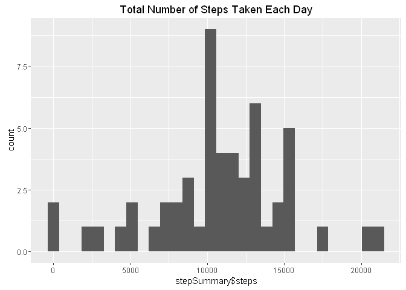
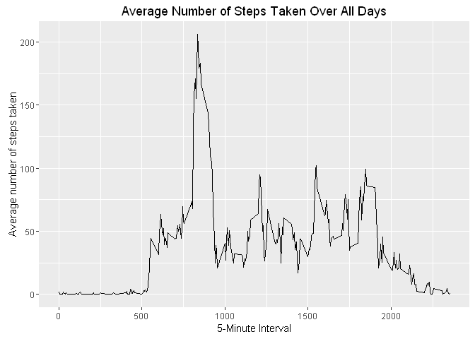
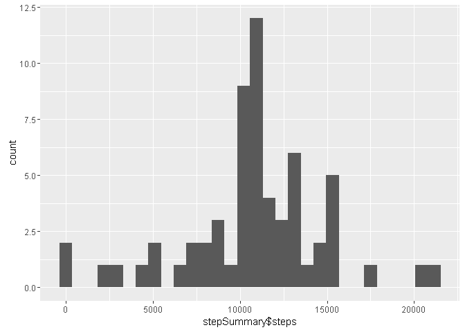
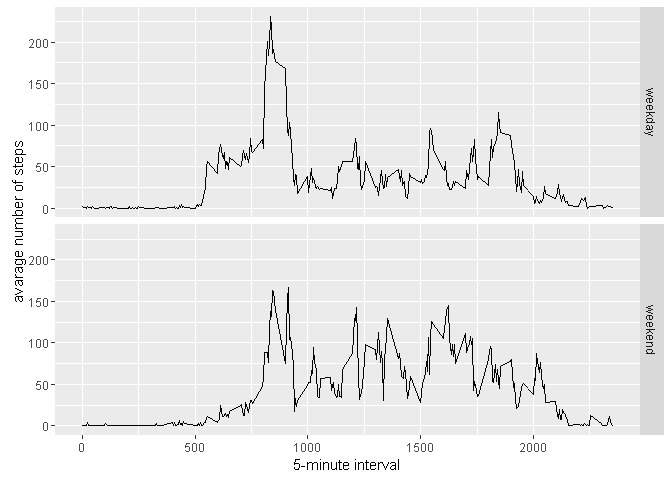

# Reproducible Research: Peer Assessment 1


## Loading and preprocessing the data
This allows the script to check if the *repdata_data_activity.zip* exists, if it doesn't exist then a copy will be downloaded. The downloaded file will then be unzipped and read into a variable called **activityData**.

### 1. Load the data (i.e. `read.csv()`)

```r
fileUrl         <- "https://d396qusza40orc.cloudfront.net/repdata%2Fdata%2Factivity.zip"
dowloadedFile   <- "repdata_data_activity.zip"

if (!file.exists(dowloadedFile)) {
    download.file(url = fileUrl, destfile = dowloadedFile)
    unzip(dowloadedFile)
}
```
### 2. Process/transform the data (if necessary) into a format suitable for your analysis

```r
activityData <- read.csv(file = "activity.csv")
head(activityData)
```

```
##   steps       date interval
## 1    NA 2012-10-01        0
## 2    NA 2012-10-01        5
## 3    NA 2012-10-01       10
## 4    NA 2012-10-01       15
## 5    NA 2012-10-01       20
## 6    NA 2012-10-01       25
```
## What is mean total number of steps taken per day?
### 1. Make a histogram of the total number of steps taken each day

```r
stepSummary <- activityData %>% na.omit() %>% group_by(date) %>% summarise(steps = sum(steps))
qplot(stepSummary$steps, main = "Total Number of Steps Taken Each Day")
```

```
## `stat_bin()` using `bins = 30`. Pick better value with `binwidth`.
```

<!-- -->

### 2. Calculate and report the **mean** and **median** total number of steps taken per day

```r
mean(stepSummary$steps)
```

```
## [1] 10766.19
```

```r
median(stepSummary$steps)
```

```
## [1] 10765
```

## What is the average daily activity pattern?
### 1. Make a time series plot (i.e. `type = "l"`) of the 5-minute interval (x-axis) and the average number of steps taken, averaged across all days (y-axis)

```r
intervalAvg <- activityData %>% na.omit() %>% group_by(interval) %>% summarise(avg = mean(steps))

ggplot(data=intervalAvg, aes(x=interval, y=avg)) +
    geom_line() +
    xlab("5-Minute Interval") +
    ylab("Average number of steps taken") +
    ggtitle("Average Number of Steps Taken Over All Days")
```

<!-- -->

### 2. Which 5-minute interval, on average across all the days in the dataset, contains the maximum number of steps?

```r
intervalAvg[which.max(intervalAvg$avg), ]
```

```
## Source: local data frame [1 x 2]
## 
##   interval      avg
##      <int>    <dbl>
## 1      835 206.1698
```

## Imputing missing values
### 1. Calculate and report the total number of missing values in the dataset (i.e. the total number of rows with `NA`s)

```r
count(activityData[is.na(activityData), ])
```

```
## Source: local data frame [1 x 1]
## 
##       n
##   <int>
## 1  2304
```
### 2. Devise a strategy for filling in all of the missing values in the dataset. The strategy does not need to be sophisticated. For example, you could use the mean/median for that day, or the mean for that 5-minute interval, etc.

```r
assumedData <- activityData
# calculate the avg step
activityRemoved <- activityData[which(!is.na(activityData$steps)),]
dailyActivity <- tapply(activityRemoved$steps, activityRemoved$interval, mean)

# replace the value
assumedData[which(is.na(assumedData$steps)), 1] <- 
    dailyActivity[as.character(assumedData[which(is.na(assumedData$steps)),3])]

count(assumedData[is.na(assumedData), ])
```

```
## Source: local data frame [1 x 1]
## 
##       n
##   <int>
## 1     0
```
### 3. Create a new dataset that is equal to the original dataset but with the missing data filled in.


```r
stepSummary <- assumedData %>% na.omit() %>% group_by(date) %>% summarise(steps = sum(steps))
qplot(stepSummary$steps)
```

```
## `stat_bin()` using `bins = 30`. Pick better value with `binwidth`.
```

<!-- -->
### 4. Make a histogram of the total number of steps taken each day and Calculate and report the **mean** and **median** total number of steps taken per day. Do these values differ from the estimates from the first part of the assignment? What is the impact of imputing missing data on the estimates of the total daily number of steps?


```r
mean(stepSummary$steps)
```

```
## [1] 10766.19
```

```r
median(stepSummary$steps)
```

```
## [1] 10766.19
```

## Are there differences in activity patterns between weekdays and weekends?
### 1. Create a new factor variable in the dataset with two levels -- "weekday" and "weekend" indicating whether a given date is a weekday or weekend day.


```r
factoredData <- mutate(assumedData, type = ifelse(as.POSIXlt(assumedData$date)$wday %in% c(0,6), 'weekend', 'weekday'))
```
### 1. Make a panel plot containing a time series plot (i.e. `type = "l"`) of the 5-minute interval (x-axis) and the average number of steps taken, averaged across all weekday days or weekend days (y-axis). The plot should look something like the following, which was created using **simulated data**:


```r
factoredSummary <- aggregate(steps ~ interval + type, data=factoredData, mean)
ggplot(factoredSummary, aes(interval, steps)) + 
    geom_line() + 
    facet_grid(type ~ .) +
    xlab("5-minute interval") + 
    ylab("avarage number of steps")
```

<!-- -->
